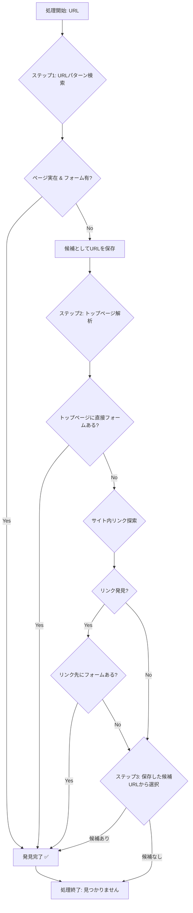

# URLFinder - 企業問い合わせページ自動検索システム

BtoB営業活動を効率化する、企業サイトからの問い合わせページ自動検索ツールです。Google Apps Script（GAS）環境で動作し、スプレッドシートと連携して大量のURLを効率的に処理できます。

## 📖 目次

- [概要](#概要)
- [主要機能](#主要機能)
- [システム要件](#システム要件)
- [セットアップ](#セットアップ)
- [使用方法](#使用方法)
- [設定項目](#設定項目)
- [アーキテクチャ](#アーキテクチャ)
- [開発者向け情報](#開発者向け情報)
- [トラブルシューティング](#トラブルシューティング)

## 概要

URLFinderは企業のWebサイトから問い合わせページを自動的に発見・抽出するシステムです。BtoB営業チームが効率的にリード獲得を行うために開発されました。

### 🎯 解決する課題

- **手動での問い合わせページ探索の非効率性**
- **大量の企業サイト調査にかかる時間コスト**
- **営業活動の初期段階でのボトルネック**

### 🚀 提供価値

- **作業時間の大幅短縮**: 手動調査と比較して90%以上の時間削減
- **高精度な検索**: 複数のアルゴリズムによる包括的な検索
- **スケーラブルな処理**: 数百〜数千のURLを一括処理

## 主要機能

### 🔍 多段階検索アルゴリズム

本システムは、精度と速度を両立させるため、以下の多段階検索フローを採用しています。処理はステップ1から順に実行され、信頼性の高い問い合わせページURLが発見された時点で探索を終了し、結果を返します。

**【ステップ1】 高速URLパターン検索 & フォーム検証**
まず、最も効率的な方法として、一般的なURLパターンから問い合わせページを推測します。
1.  **URL生成**: `contact`や`inquiry`などのキーワードを基に、`/contact`のような候補URLを複数生成します。
2.  **実在確認 & フォーム検出**: 生成したURLにアクセスし、ページが実在するかを確認します。ページが存在した場合、そのHTML内に実際に入力可能なフォーム（`<form>`タグや送信ボタンなど）が存在するかを検証します。
3.  **候補の保存**: このステップでページは存在するものの、明確なフォームが見つからなかったURLは、後の「最終フォールバック」のために一時的に保存されます。

**【ステップ2】 トップページ解析 & サイト内リンク探索**
ステップ1で見つからない場合、検索対象のトップページにアクセスし、そのHTML自体を詳細に解析します。
1.  **トップページ直接検証**: まず、トップページ内に問い合わせフォームが直接埋め込まれていないかを確認します。
    *   **検証対象**: 標準的なHTMLフォーム、Googleフォーム、reCAPTCHAを用いたJavaScriptフォーム、その他サードパーティ製（Typeform, HubSpot等）の埋め込みフォームを検出します。
2.  **サイト内リンク解析**: トップページに直接フォームがない場合、サイトの主要なナビゲーション領域（ヘッダー、フッター、メニューなど）に含まれるリンクをすべて抽出します。
    *   **キーワード照合**: 抽出したリンクのテキスト（例: `お問い合わせはこちら`）やURL自体（例: `/contact-us`）を分析し、「問い合わせ」「相談」「contact」といったキーワードとの関連性をスコアリングします。
3.  **リンク先のフォーム検証**: スコアが最も高かったリンクを最有力候補とし、そのURLに実際にアクセスします。取得したリンク先のページHTML内に、手順1と同様のフォームが存在するかを最終的に検証し、存在が確認できた場合のみ結果として採用します。

**【ステップ3】 最終フォールバック（候補URLの再検証）**
上記すべての方法で有効なフォームが見つからなかった場合の最終手段です。
1.  **候補リストの参照**: ステップ1で「ページは存在する（HTTP 200 OK）が、明確なフォームが見つからなかった」として一時保存されたURLのリストを参照します。
2.  **優先順位に基づき選択**: このリストの中から、`/contact` や `/inquiry` といった、より一般的で問い合わせページである可能性が高いURLパターンに合致するものを優先的に選択します。
3.  **結果の提示**: 最も信頼性が高いと判断されたURLを、最終的な候補として提示します。これにより、完全な探索失敗を避け、手動確認の足がかりを提供します。

---

#### 🔄 処理フロー図 (Mermaid)



### 📊 対応フォーム形式

- **従来型HTMLフォーム**: 標準的なform要素
- **Google Forms**: Googleフォーム統合
- **埋め込みフォーム**: サードパーティフォームウィジェット
- **SPA（Single Page Application）**: JavaScript動的フォーム

### 🚫 非対応・エラーとなるケース

本システムは多くのWebサイトに対応していますが、問い合わせページを発見できなかったり、処理中にエラーが発生したりする場合があります。その際に返される主なメッセージと原因は以下の通りです。

| エラーメッセージ / 分類 | 主な原因 |
| :--- | :--- |
| **SNSページ** | 入力されたURLがSNS（Facebook, X, Instagram等）のドメインであると判定された場合、処理対象外となります。 |
| **DNS解決失敗: ドメインが存在しません** | 入力されたURLのドメインが存在しない、または名前解決ができませんでした。URLの綴りを確認してください。 |
| **サイトが見つかりません（404）** | 入力されたURLにアクセスした結果、ページが存在しない（404 Not Found）と判断されました。サイト自体が存在しないか、URLが間違っている可能性があります。 |
| **Forbidden - アクセス拒否（403）** | サイト側のセキュリティポリシー（WAF, IPアドレス制限など）により、プログラムからのアクセスが明確に拒否されました。 |
| **Not Implemented - Bot対策によりブロック（501）** | Cloudflare等の高度なBot対策システムにより、人間による操作ではないと判断され、アクセスがブロックされた可能性があります。 |
| **処理タイムアウト：サイトの応答が遅いため処理を中断しました** | MAX_TOTAL_TIMEで設定された制限時間を超過したため、処理が中断されました。サイトが重いか、ネットワークが不安定な可能性があります。 |
| **GASエラー: アクセスに失敗しました** | Google Apps Scriptの実行上の問題（ネットワークの不安定、Googleインフラの一時的な問題など）で、サイトへのアクセス自体に失敗した場合に発生します。 |
| **問い合わせフォームが見つかりませんでした** | 上記のエラーには該当せず、全ての検索ステップを実行しましたが、最終的に問い合わせフォームを特定できませんでした。サイトの構造が特殊であるか、フォームが画像になっている可能性があります。 |

### 🖥️ ユーザーインターフェース

- **スプレッドシート統合**: 直感的なデータ入出力
- **進捗表示UI**: リアルタイムの処理状況確認
- **選択的処理**: チェックボックスによる対象行指定
- **エラーハンドリング**: 詳細なエラー情報提供

## システム要件

### 必須環境

- **Google Apps Script**: 実行環境
- **Google Spreadsheet**: データ管理
- **インターネット接続**: 外部サイトアクセス

### 推奨設定

- **処理件数**: 一度に50件まで（タイムアウト対策）
- **タイムアウト設定**: 30秒（大規模サイト対応）

## セットアップ

### 1. プロジェクトの準備

```bash
# 開発環境での準備（開発者向け）
cd packages/URLFinder
npm install
npm run build
```

### 2. GASプロジェクトの設定

1. **新しいGASプロジェクトを作成**
2. **生成されたファイルをアップロード**
   - `dist/main.js` → `Code.js`
   - `dist/simple-options.html` → HTMLファイル
   - `dist/progress.html` → HTMLファイル

### 3. スクリプトプロパティの設定

以下の設定をGASエディタの「プロジェクトの設定」→「スクリプトプロパティ」で行います：

#### GASスクリプトプロパティ設定(必須)

```
SHEET: "リスト"                    # 処理対象のシート名
MAX_COUNT: "30"                      # 一度に処理する最大件数（上限数）
HEADER_ROW: "3"                      # ヘッダー行番号
TARGET_COLUMN: "12"                  # URL取得列（L列=12）
OUTPUT_COLUMN: "42"                  # 結果出力列（AP列=42）
CHECK_COLUMN: "43"                   # チェックボックス列（AQ列=43）
MAX_TOTAL_TIME: "100000"              # 全体処理タイムアウト（ミリ秒）
```

#### アプリ内設定値（未設定時はデフォルト値使用）

```
FETCH_TIMEOUT: "7000"                # HTTP通信タイムアウト（ミリ秒）
HIGH_CONFIDENCE_THRESHOLD: "80"      # 高信頼度判定スコア
MEDIUM_CONFIDENCE_THRESHOLD: "60"    # 中信頼度判定スコア
MINIMUM_ACCEPTABLE_THRESHOLD: "40"   # 最小許容スコア
```

### 4. スプレッドシートの準備

| 列 | 内容 | 例 |
|----|------|-----|
| L列 | 検索対象URL | `https://example.com` |
| AP列 | 検索結果 | `https://example.com/contact` |
| AQ列 | チェックボックス | ☑️ |

## 使用方法

### 基本的な使い方

1. **URLの準備**
   - L列に検索対象のURLを入力
   - ヘッダー行（通常1行目）は処理対象外

2. **実行方法の選択**

   #### 方法A: 全体処理
   ```javascript
   processContactPageFinder(); // GASエディタから実行
   ```

   #### 方法B: UI付き実行
   ```javascript
   executeUrlFinderWithUI(); // ダイアログ表示
   ```

3. **結果の確認**
   - AP列に検索結果が出力されます
   - エラーの場合は詳細メッセージが表示されます

### 高度な使用方法

#### チェック行のみ処理

```javascript
executeCheckedRowsProcessing(); // AQ列でチェックされた行のみ処理
```

#### 単体テスト

```javascript
test(); // 特定URLでのテスト実行
```

#### プログラマティックな呼び出し

```javascript
const result = findContactPage('https://example.com');
console.log(result.contactUrl);     // 問い合わせページURL
console.log(result.searchMethod);   // 使用された検索手法
console.log(result.foundKeywords);  // 発見されたキーワード
```

## 設定項目

### 列設定の変更

スプレッドシートの列構成を変更する場合は、スクリプトプロパティを更新してください：

```javascript
// 例：URL列をB列（2）、結果列をZ列（26）に変更
PropertiesService.getScriptProperties().setProperties({
  'TARGET_COLUMN': '2',   // B列
  'OUTPUT_COLUMN': '26'   // Z列
});
```

### パフォーマンス調整

#### 処理件数の調整

スクリプトプロパティの`MAX_COUNT`値を変更することで処理件数を調整できます：

```javascript
// 例：30件に変更
PropertiesService.getScriptProperties().setProperty('MAX_COUNT', '30');

// 例：20件に変更（大量データでパフォーマンス重視）
PropertiesService.getScriptProperties().setProperty('MAX_COUNT', '20');

// 例：50件に変更（高速環境での大量処理）
PropertiesService.getScriptProperties().setProperty('MAX_COUNT', '50');
```

設定した値は、通常処理とチェック行処理の両方で上限として適用されます。

#### タイムアウト調整
```javascript
// 重いサイト対応のためタイムアウトを延長
PropertiesService.getScriptProperties().setProperties({
  'MAX_TOTAL_TIME': '100000',  // 1分40秒　GASスクリプトプロパティで設定
  'FETCH_TIMEOUT': '10000'    // 10秒
});
```

### 検索精度調整

#### 閾値の調整
```javascript
// より厳密な検索条件
PropertiesService.getScriptProperties().setProperties({
  'HIGH_CONFIDENCE_THRESHOLD': '90',
  'MEDIUM_CONFIDENCE_THRESHOLD': '70',
  'MINIMUM_ACCEPTABLE_THRESHOLD': '50'
});
```

## アーキテクチャ

### 🏗️ システム構成

```
URLFinder/
├── src/
│   ├── ContactPageFinder.ts       # メイン検索ロジック
│   ├── gas-integration.ts         # GAS統合機能
│   ├── index.ts                   # エントリーポイント
│   ├── env.ts                     # 環境設定管理
│   ├── modules/                   # 機能モジュール群
│   │   ├── initialization/        # 初期化・検証
│   │   ├── step2Analysis/         # HTML解析
│   │   ├── fallbackSystem/        # フォールバック処理
│   │   ├── formValidation/        # フォーム検証
│   │   ├── linkAnalysis/          # リンク解析
│   │   ├── httpUtils/             # HTTP通信
│   │   └── spaAnalysis/           # SPA対応
│   ├── analyzers/                 # 解析エンジン
│   ├── strategies/                # 検索戦略
│   ├── utils/                     # ユーティリティ
│   └── types/                     # 型定義
└── dist/                          # ビルド出力
```

### 🔄 処理フロー

```
URLリスト → 初期化・検証 → SNS判定 → URLパターン検索 → HTML解析 → 最終フォールバック → 結果出力
```

### 🧩 主要コンポーネント

#### ContactPageFinder
- **役割**: メイン検索ロジック
- **機能**: 多段階検索アルゴリズムの統合実行
- **設計**: 状態管理とモジュール連携

#### Environment
- **役割**: 設定管理
- **機能**: スクリプトプロパティの一元管理
- **特徴**: 必須設定とデフォルト値の適切な分離

#### GAS Integration
- **役割**: Google Apps Script連携
- **機能**: スプレッドシート操作、UI提供
- **特徴**: 柔軟な列設定、エラーハンドリング

## 関数リファレンス

### 🔧 主要関数

#### `processContactPageFinder()`
- **用途**: メイン処理関数（スプレッドシート一括処理）
- **機能**: L列からURL取得、AP列に結果出力
- **特記事項**: **トリガー設定するならこの関数を使用**

#### `executeUrlFinderWithUI()`
- **用途**: UI付き実行
- **機能**: ダイアログ表示、処理オプション選択
- **主な使用場面**: 手動実行、設定確認

#### `test()`
- **用途**: 単体テスト
- **機能**: 指定URLでの動作検証
- **主な使用場面**: 機能確認、デバッグ

#### `executeCheckedRowsProcessing()`
- **用途**: チェック行処理
- **機能**: AQ列でチェックされた行のみ処理
- **主な使用場面**: 部分実行、再処理

#### `findContactPage(url)`
- **用途**: 後方互換ラッパー関数
- **パラメータ**: `url` - 検索対象URL（文字列）
- **戻り値**: ContactPageResult オブジェクト

## 開発者向け情報

### 🛠️ 開発環境セットアップ

```bash
# 依存関係のインストール
npm install

# 開発用ビルド（ウォッチモード）
npm run dev

# 本番用ビルド
npm run build

# 型チェック
npm run type-check

# リント
npm run lint
```

### 📝 コーディング規約

#### TypeScript設定
- **厳密な型チェック**: `strict: true`
- **ES2019ターゲット**: GAS互換性確保
- **モジュールシステム**: ES Modules + CommonJS出力

#### アーキテクチャ原則
- **単一責任原則**: 1ファイル150-300行目安
- **依存性逆転**: インターフェース経由の結合
- **関数型指向**: 純粋関数の積極活用

### 🔧 ビルドシステム

#### esbuild設定
```javascript
// esbuild.config.js
{
  bundle: true,
  platform: "node",
  target: "es2019",
  format: "cjs",
  plugins: [GasPlugin],
  // GAS互換性確保のための後処理
}
```

#### 出力最適化
- **CommonJS除去**: `module.exports` 自動削除
- **HTMLファイル**: 自動コピー処理
- **バンドルサイズ**: 最適化済み

### 🧪 テスト戦略

#### 単体テスト
```javascript
// テスト実行
test(); // 指定URLでの動作テスト
```

#### 統合テスト
```javascript
// 実際のスプレッドシートでのテスト
function integrationTest() {
  processContactPageFinder();
}
```

### 📊 パフォーマンス考慮事項

#### メモリ使用量
- **最大同時処理**: 50URL
- **キャッシュ戦略**: 同一ドメイン判定結果
- **ガベージコレクション**: 適切なオブジェクト解放

#### ネットワーク最適化
- **HTTP/2対応**: 可能な場合は使用
- **タイムアウト管理**: 段階的タイムアウト設定
- **レート制限**: 同一ドメインへの過度なリクエスト防止

## トラブルシューティング

### よくある問題と解決方法

#### 🚫 関数が認識されない
```
エラー: 関数processContactPageFinderが見つかりません
```
**解決方法**:
1. `dist/main.js`が正しくアップロードされているか確認
2. GASエディタでリロードを実行
3. 関数リストの更新を待つ

#### ⏱️ タイムアウトエラー
```
エラー: タイムアウトが発生しました
```
**解決方法**:
1. MAX_COUNTを削減（例：50 → 30）
2. MAX_TOTAL_TIMEを延長（例：100000 → 200000）
3. 重いサイトを除外

#### 📊 スクリプトプロパティエラー
```
エラー: TARGET_COLUMN プロパティが設定されていません
```
**解決方法**:
1. GASエディタ → プロジェクトの設定 → スクリプトプロパティ
2. 必須プロパティを設定
3. 値は数字の文字列で設定（例："12"）

#### 🔍 検索結果が見つからない
```
結果: 問い合わせフォームが見つかりませんでした
```
**考えられる原因**:
- サイトがJavaScriptを多用している
- 非標準的なフォーム実装
- アクセス制限（bot検出）

**対策**:
1. 閾値を下げる（MINIMUM_ACCEPTABLE_THRESHOLD）
2. 手動確認による検証
3. サイト構造の個別調査

### 🔧 デバッグ方法

#### ログ確認
```javascript
// GASエディタの実行ログを確認
console.log('Debug info:', result);
```

#### 段階的テスト
```javascript
// 単一URLでのテスト
const result = findContactPage('https://problematic-site.com');
console.log('Result:', result);
```

#### 設定値確認
```javascript
// 現在の設定値を確認
const properties = PropertiesService.getScriptProperties().getProperties();
console.log('Current settings:', properties);
```

---

## 📞 サポート

技術的な質問や問題が発生した場合は、開発チームまでお問い合わせください。

**システム情報**:
- Version: 1.0.0
- Platform: Google Apps Script
- Language: TypeScript
- Build Tool: esbuild
